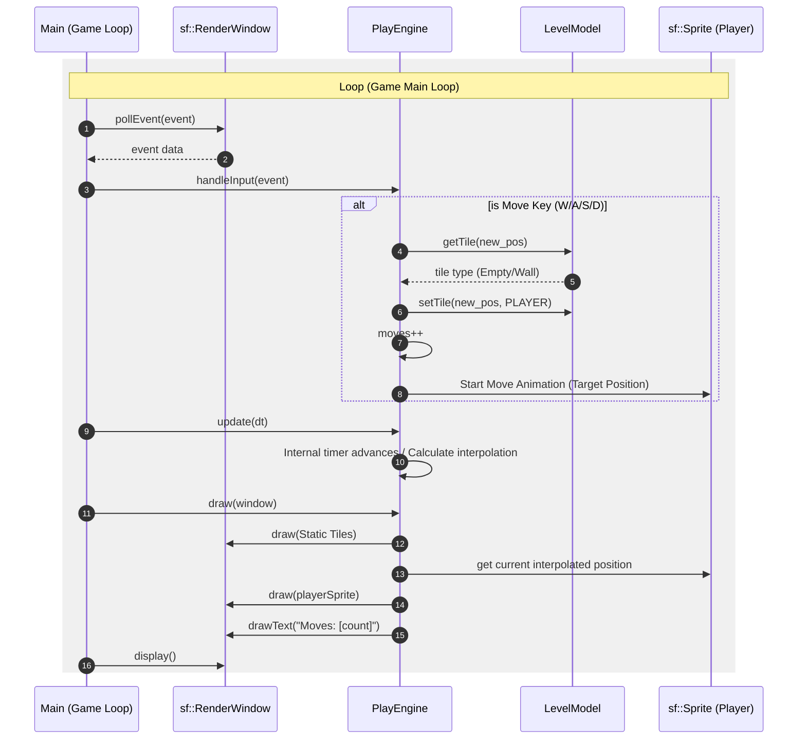
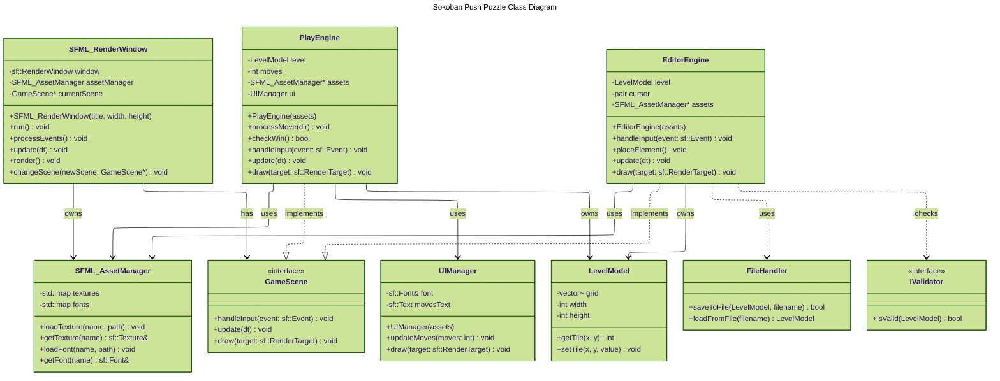

# Project2

```mermaid
sequenceDiagram
    autonumber
    participant M as Main (Game Loop)
    participant W as sf::RenderWindow
    participant P as PlayEngine
    participant L as LevelModel
    participant S as sf::Sprite (Player)

    rect rgb(240, 240, 240)
    Note over M, S: Loop (Game Main Loop)
    
    M->>W: pollEvent(event)
    W-->>M: event data
    
    M->>P: handleInput(event)
    alt is Move Key (W/A/S/D)
        P->>L: getTile(new_pos)
        L-->>P: tile type (Empty/Wall)
        P->>L: setTile(new_pos, PLAYER)
        P->>P: moves++
        P->>S: Start Move Animation (Target Position)
    end

    M->>P: update(dt)
    P->>P: Internal timer advances / Calculate interpolation

    M->>P: draw(window)
    P->>W: draw(Static Tiles)
    P->>S: get current interpolated position
    P->>W: draw(playerSprite)
    P->>W: drawText("Moves: [count]")
    
    M->>W: display()
    end
```

```mermaid
---
config:
  layout: elk
  theme: forest
title: Sokoban Push Puzzle Class Diagram
---
classDiagram
direction TB
    class SFML_RenderWindow {
	    -sf::RenderWindow window
	    -SFML_AssetManager assetManager
	    -GameScene* currentScene
	    +SFML_RenderWindow(title, width, height)
	    +run() void
	    +processEvents() void
	    +update(dt) void
	    +render() void
	    +changeScene(newScene: GameScene*) void
    }

    class SFML_AssetManager {
	    -std::map textures
	    -std::map fonts
	    +loadTexture(name, path) void
	    +getTexture(name) sf::Texture&
	    +loadFont(name, path) void
	    +getFont(name) sf::Font&
    }

    class GameScene {
	    +handleInput(event: sf::Event) void
	    +update(dt) void
	    +draw(target: sf::RenderTarget) void
    }

    class PlayEngine {
	    -LevelModel level
	    -int moves
	    -SFML_AssetManager* assets
	    -UIManager ui
	    +PlayEngine(assets)
	    +processMove(dir) void
	    +checkWin() bool
	    +handleInput(event: sf::Event) void
	    +update(dt) void
	    +draw(target: sf::RenderTarget) void
    }

    class EditorEngine {
	    -LevelModel level
	    -pair cursor
	    -SFML_AssetManager* assets
	    +EditorEngine(assets)
	    +handleInput(event: sf::Event) void
	    +placeElement() void
	    +update(dt) void
	    +draw(target: sf::RenderTarget) void
    }

    class UIManager {
	    -sf::Font& font
	    -sf::Text movesText
	    +UIManager(assets)
	    +updateMoves(moves: int) void
	    +draw(target: sf::RenderTarget) void
    }

    class LevelModel {
	    -vector~ grid
	    -int width
	    -int height
	    +getTile(x, y) int
	    +setTile(x, y, value) void
    }

    class FileHandler {
	    +saveToFile(LevelModel, filename) bool
	    +loadFromFile(filename) LevelModel
    }

    class IValidator {
	    +isValid(LevelModel) bool
    }

	<<interface>> GameScene
	<<interface>> IValidator

    SFML_RenderWindow --> SFML_AssetManager : owns
    SFML_RenderWindow --> GameScene : has
    PlayEngine ..|> GameScene : implements
    EditorEngine ..|> GameScene : implements
    PlayEngine --> LevelModel : owns
    PlayEngine --> SFML_AssetManager : uses
    PlayEngine --> UIManager : uses
    EditorEngine --> LevelModel : owns
    EditorEngine --> SFML_AssetManager : uses
    EditorEngine ..> FileHandler : uses
    EditorEngine ..> IValidator : checks
```
